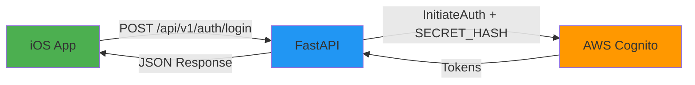

# 🎯 BACKEND-CENTRIC AUTH IMPLEMENTATION PLAN

## Architecture: Backend as Single Source of Truth

All authentication flows through the backend. Mobile app NEVER talks to Cognito directly.



## 📱 FRONTEND IMPLEMENTATION (90% of the work)

### Step 1: Remove ALL Direct Cognito Calls

**Files to modify:**
- `Core/Services/CognitoAuthService.swift` - Remove or disable
- `Core/Services/AuthService.swift` - Update to use APIClient only
- `Core/Services/CognitoConfiguration.swift` - Delete or comment out

### Step 2: Update AuthService

```swift
// AuthService.swift
import Foundation
import Observation

@Observable
final class AuthService: AuthServiceProtocol {
    private let apiClient: APIClientProtocol
    private let tokenManager: TokenManager
    
    var isAuthenticated = false
    var currentUser: User?
    
    init(apiClient: APIClientProtocol) {
        self.apiClient = apiClient
        self.tokenManager = TokenManager.shared
    }
    
    func signIn(email: String, password: String) async throws {
        // NO MORE COGNITO DIRECT CALLS!
        let response = try await apiClient.login(
            email: email,
            password: password,
            rememberMe: false
        )
        
        // Store tokens
        await tokenManager.store(
            accessToken: response.accessToken,
            refreshToken: response.refreshToken,
            expiresIn: response.expiresIn
        )
        
        // Update state
        self.currentUser = response.user
        self.isAuthenticated = true
    }
    
    func signOut() async throws {
        // Optional: Call backend logout endpoint
        try? await apiClient.logout()
        
        // Clear local state
        await tokenManager.clear()
        self.currentUser = nil
        self.isAuthenticated = false
    }
    
    func refreshTokenIfNeeded() async throws {
        guard let refreshToken = await tokenManager.getRefreshToken() else {
            throw AuthError.notAuthenticated
        }
        
        let expiresIn = await tokenManager.getTokenExpiryTime()
        
        // Refresh if less than 60 seconds remaining
        if expiresIn <= 60 {
            let response = try await apiClient.refreshToken(refreshToken: refreshToken)
            
            await tokenManager.store(
                accessToken: response.accessToken,
                refreshToken: response.refreshToken,
                expiresIn: response.expiresIn
            )
        }
    }
}
```

### Step 3: Update APIClient Login Method

```swift
// APIClient.swift - Update login method
func login(email: String, password: String, rememberMe: Bool) async throws -> LoginResponse {
    let endpoint = "/api/v1/auth/login"
    
    let deviceInfo = DeviceInfoHelper.getCurrentDeviceInfo()
    
    let payload = LoginRequest(
        email: email,
        password: password,
        rememberMe: rememberMe,
        deviceInfo: deviceInfo
    )
    
    let response: LoginResponse = try await request(
        endpoint: endpoint,
        method: .post,
        body: payload
    )
    
    return response
}

func refreshToken(refreshToken: String) async throws -> TokenResponse {
    let endpoint = "/api/v1/auth/refresh"
    
    let payload = RefreshTokenRequest(refreshToken: refreshToken)
    
    let response: TokenResponse = try await request(
        endpoint: endpoint,
        method: .post,
        body: payload
    )
    
    return response
}

func logout() async throws {
    let endpoint = "/api/v1/auth/logout"
    
    try await request(
        endpoint: endpoint,
        method: .post,
        body: EmptyBody()
    )
}
```

### Step 4: Add Token Interceptor

```swift
// APIClient.swift - Add token to all requests
private func createRequest<T: Encodable>(
    endpoint: String,
    method: HTTPMethod,
    body: T?,
    headers: [String: String] = [:]
) async throws -> URLRequest {
    guard let url = URL(string: "\(baseURL)\(endpoint)") else {
        throw APIError.invalidURL
    }
    
    var request = URLRequest(url: url)
    request.httpMethod = method.rawValue
    
    // Add default headers
    var allHeaders = headers
    allHeaders["Content-Type"] = "application/json"
    
    // Add Authorization header if we have a token
    if let accessToken = await tokenManager.getAccessToken() {
        allHeaders["Authorization"] = "Bearer \(accessToken)"
    }
    
    // Apply all headers
    allHeaders.forEach { request.setValue($1, forHTTPHeaderField: $0) }
    
    // Add body if present
    if let body = body {
        request.httpBody = try JSONEncoder().encode(body)
    }
    
    return request
}
```

### Step 5: Update Response Models

```swift
// Models/AuthModels.swift
struct LoginResponse: Codable {
    let accessToken: String
    let refreshToken: String
    let expiresIn: Int
    let user: User?
    
    enum CodingKeys: String, CodingKey {
        case accessToken = "access_token"
        case refreshToken = "refresh_token"
        case expiresIn = "expires_in"
        case user
    }
}

struct TokenResponse: Codable {
    let accessToken: String
    let refreshToken: String
    let expiresIn: Int
    
    enum CodingKeys: String, CodingKey {
        case accessToken = "access_token"
        case refreshToken = "refresh_token"
        case expiresIn = "expires_in"
    }
}

struct RefreshTokenRequest: Codable {
    let refreshToken: String
    
    enum CodingKeys: String, CodingKey {
        case refreshToken = "refresh_token"
    }
}
```

### Step 6: Implement Token Manager

```swift
// TokenManager.swift
import Foundation

actor TokenManager {
    static let shared = TokenManager()
    
    private let keychain = KeychainHelper()
    private var tokenExpiryDate: Date?
    
    private init() {}
    
    func store(accessToken: String, refreshToken: String, expiresIn: Int) {
        keychain.save(accessToken, forKey: "access_token")
        keychain.save(refreshToken, forKey: "refresh_token")
        
        // Calculate expiry date
        tokenExpiryDate = Date().addingTimeInterval(TimeInterval(expiresIn))
    }
    
    func getAccessToken() -> String? {
        return keychain.load(forKey: "access_token")
    }
    
    func getRefreshToken() -> String? {
        return keychain.load(forKey: "refresh_token")
    }
    
    func getTokenExpiryTime() -> Int {
        guard let expiryDate = tokenExpiryDate else { return 0 }
        let timeRemaining = expiryDate.timeIntervalSinceNow
        return max(0, Int(timeRemaining))
    }
    
    func clear() {
        keychain.delete(forKey: "access_token")
        keychain.delete(forKey: "refresh_token")
        tokenExpiryDate = nil
    }
}
```

### Step 7: Remove Cognito Config from Info.plist

Remove these keys:
- `CognitoUserPoolId`
- `CognitoClientId`
- `CognitoClientSecret`
- Any AWS-related configuration

### Step 8: Update Tests

```swift
// AuthServiceTests.swift
func testLogin() async throws {
    let mockClient = MockAPIClient()
    mockClient.loginResponse = LoginResponse(
        accessToken: "mock_access",
        refreshToken: "mock_refresh",
        expiresIn: 3600,
        user: User(id: "123", email: "test@example.com")
    )
    
    let authService = AuthService(apiClient: mockClient)
    
    try await authService.signIn(email: "test@example.com", password: "password")
    
    XCTAssertTrue(authService.isAuthenticated)
    XCTAssertNotNil(authService.currentUser)
}
```

## 🚀 BACKEND REQUIREMENTS (10% of the work)

### Endpoints to Verify/Implement:

1. **POST /api/v1/auth/login**
```json
Request:
{
  "email": "user@example.com",
  "password": "password123",
  "remember_me": false,
  "device_info": {
    "device_id": "xxx",
    "platform": "iOS",
    "os_version": "18.0",
    "app_version": "1.0.0"
  }
}

Response:
{
  "access_token": "eyJ...",
  "refresh_token": "eyJ...",
  "expires_in": 3600,
  "user": {
    "id": "123",
    "email": "user@example.com",
    "name": "User Name"
  }
}
```

2. **POST /api/v1/auth/refresh**
```json
Request:
{
  "refresh_token": "eyJ..."
}

Response:
{
  "access_token": "eyJ...",
  "refresh_token": "eyJ...",
  "expires_in": 3600
}
```

3. **POST /api/v1/auth/logout** (Optional)
```json
Request:
{
  "refresh_token": "eyJ..."
}

Response:
{
  "message": "Logged out successfully"
}
```

## ✅ Definition of Done

- [ ] All Cognito direct calls removed from iOS app
- [ ] Login works through `/api/v1/auth/login` only
- [ ] Tokens stored securely in Keychain
- [ ] Authorization header added to all API requests
- [ ] Token refresh implemented (< 60s remaining)
- [ ] No AWS/Cognito secrets in app bundle
- [ ] All auth tests passing

## 🧪 Testing Commands

```bash
# Test backend login
curl -X POST "http://clarity-alb-1762715656.us-east-1.elb.amazonaws.com/api/v1/auth/login" \
  -H "Content-Type: application/json" \
  -d '{
    "email": "test@example.com",
    "password": "Passw0rd!",
    "remember_me": false,
    "device_info": {
      "device_id": "test-123",
      "platform": "iOS",
      "os_version": "18.0",
      "app_version": "1.0.0"
    }
  }'

# Test token refresh
curl -X POST "http://clarity-alb-1762715656.us-east-1.elb.amazonaws.com/api/v1/auth/refresh" \
  -H "Content-Type: application/json" \
  -d '{
    "refresh_token": "YOUR_REFRESH_TOKEN_HERE"
  }'
```

## 🎯 Success Criteria

1. iOS app successfully logs in through backend
2. Protected API calls work with Bearer token
3. Token auto-refreshes before expiry
4. No Cognito secrets on device
5. Backend handles all Cognito complexity

---

**This is the way! Backend-centric auth for security, simplicity, and future-proofing!** 🚀