# Backend Authentication Expectations vs iOS Reality

## What Backend EXPECTS to Receive


## What iOS is ACTUALLY Sending (From Logs)

```mermaid
graph LR
    A[iOS Token] --> B[JWT Structure]
    B --> C[Header: RS256, kid: a4a10dece...]
    B --> D[Payload: iss: https://securetoken.google.com/clarity-loop-backend]
    B --> E[Signature: Valid RS256 signature]
    
    D --> F[aud: clarity-loop-backend ✅]
    D --> G[user_id: vW6fVj6kxWgznkShWS6R4FWEh4J2 ✅]
    D --> H[iat: 1749464455 (10:20:55 UTC) ✅]
    D --> I[exp: 1749468055 (11:20:55 UTC) ✅]
    D --> J[email: jj@novamindnyc.com ✅]
    
    style F fill:#00ff00
    style G fill:#00ff00
    style H fill:#00ff00
    style I fill:#00ff00
    style J fill:#00ff00
```

## Backend Middleware Execution (From Modal Logs)

```mermaid
sequenceDiagram
    participant Client as iOS App
    participant Modal as Modal Server
    participant MW as Middleware
    participant FB as Firebase Admin
    participant Handler as Route Handler
    
    Client->>Modal: GET /api/v1/insights/history/{userId}
    Note over Client,Modal: Authorization: Bearer eyJhbGci...
    
    Modal->>MW: Request enters middleware
    MW->>MW: Log "🔥🔥 MIDDLEWARE ACTUALLY RUNNING"
    MW->>MW: Extract Authorization header ✅
    MW->>MW: Remove "Bearer " prefix ✅
    
    rect rgb(255, 0, 0)
        Note over MW,FB: FAILURE HAPPENS HERE
        MW->>FB: verify_id_token(token)
        FB-->>MW: ❌ Verification fails (silent)
    end
    
    MW->>MW: request.state.user = None
    MW->>MW: Log "No user context in request.state"
    MW->>Handler: Continue without user
    Handler->>Handler: Check request.state.user
    Handler->>Modal: 401 Unauthorized
    Modal->>Client: 401 Response
```



## Time Analysis

```mermaid
gantt
    title Token Timeline (All times UTC)
    dateFormat HH:mm
    axisFormat %H:%M
    
    section Token Lifecycle
    Token Issued           :done, token1, 10:20, 1h
    Token Valid Until      :active, token2, 10:20, 11:20
    
    section Request Timeline
    First Request (10:22)  :crit, req1, 10:22, 1m
    Current Time (10:31)   :milestone, 10:31, 0
    Token Still Valid      :done, valid, 10:31, 49m
```

## Discrepancy Analysis

### iOS Says ✅
- Token is valid (not expired)
- Token has correct project ID
- Token was freshly generated
- Authorization header is sent correctly

### Backend Says ❌
- Middleware runs
- But Firebase verification fails
- No error details logged
- request.state.user remains None

## The REAL Problem


## Evidence Summary

| Component | Status | Evidence |
|-----------|--------|----------|
| iOS Token Generation | ✅ WORKING | Fresh tokens with correct format |
| iOS Token Refresh | ✅ WORKING | TokenManagementService forces refresh |
| iOS HTTP Headers | ✅ WORKING | Authorization: Bearer {token} sent |
| Backend Middleware | ✅ RUNNING | "MIDDLEWARE ACTUALLY RUNNING" in logs |
| Firebase Verification | ❌ FAILING | Silent failure, no user context set |
| Error Logging | ❌ MISSING | No details on WHY verification fails |