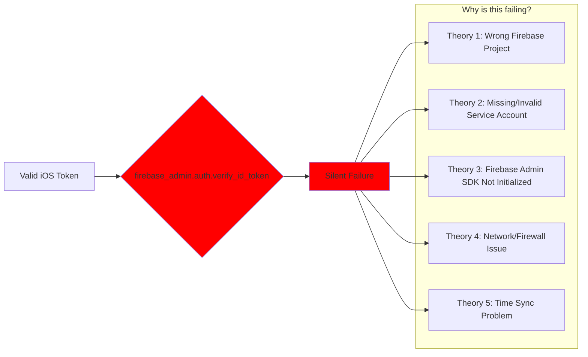

# DEFINITIVE Authentication Timeline & Failure Analysis

## The Exact Timeline (All times UTC on June 9, 2025)

```mermaid
timeline
    title Authentication Events Timeline
    
    10:20:55 : iOS: Token generated (iat: 1749464455)
              : Token will expire at 11:20:55 (exp: 1749468055)
              : Token cached in TokenManagementService
    
    10:22:03 : iOS: First API request to /insights/history
              : Token age: 1.13 minutes (FRESH)
              : Time until expiration: 58.87 minutes
              : Backend: 🔥 MIDDLEWARE ACTUALLY RUNNING
              : Backend: ❌ Returns 401 - "No user context"
    
    10:22:12 : iOS: Retry with same token (still valid)
              : Backend: ❌ Returns 401 again
    
    10:31:48 : Current time when analyzing logs
              : Token age: 10.88 minutes (STILL FRESH)
              : Time until expiration: 49.12 minutes
              : Token is 100% VALID
```

## The Authentication Chain

```mermaid
graph TD
    subgraph "✅ WORKING - iOS Side"
        A[1. User logged in with Firebase] -->|Success| B[2. TokenManagementService.getValidToken()]
        B -->|10:20:55 UTC| C[3. Firebase issues JWT token]
        C -->|Valid for 60 min| D[4. Token cached locally]
        D -->|On API call| E[5. Token added to Authorization header]
        E -->|Bearer eyJhbG...| F[6. HTTPS request sent to backend]
    end
    
    subgraph "✅ WORKING - Network Layer"
        F -->|TLS encrypted| G[7. Request reaches Modal server]
        G -->|Headers intact| H[8. Middleware receives request]
    end
    
    subgraph "❌ FAILING - Backend Side"
        H -->|✅| I[9. Middleware extracts token from header]
        I -->|✅| J[10. Removes 'Bearer ' prefix]
        J -->|❌| K[11. firebase_admin.auth.verify_id_token(token)]
        K -->|Silent failure| L[12. No exception logged]
        L -->|Result| M[13. request.state.user = None]
        M -->|Check fails| N[14. Route handler returns 401]
    end
    
    style K fill:#ff0000,stroke:#ffffff,stroke-width:4px
    style L fill:#ff0000,stroke:#ffffff,stroke-width:4px
    style M fill:#ff0000,stroke:#ffffff,stroke-width:4px
    style N fill:#ff0000,stroke:#ffffff,stroke-width:4px
```

## Token Validity Analysis

```python
# Token timestamps (Unix epoch)
iat = 1749464455  # Issued at: June 9, 2025 10:20:55 UTC
exp = 1749468055  # Expires at: June 9, 2025 11:20:55 UTC

# Request timestamps
first_request = "10:22:03 UTC"  # 68 seconds after token issued
current_time = "10:31:48 UTC"   # 653 seconds after token issued

# Token validity
token_lifetime = exp - iat  # 3600 seconds (1 hour)
time_elapsed = 653  # seconds since token issued
time_remaining = 3600 - 653  # 2947 seconds (~49 minutes)

# RESULT: Token is 100% VALID
```

## What Each Side Sees

### iOS Perspective ✅
```
✅ Fresh token obtained at 10:20:55
✅ Token expires at 11:20:55 (1 hour lifetime)
✅ Token added to Authorization header
✅ Request sent to: https://crave-trinity-prod--clarity-backend-fastapi-app.modal.run
✅ Retry logic working (attempts refresh on 401)
❌ Always gets 401 response
```

### Backend Perspective ❌
```
✅ Request received
✅ Middleware runs ("MIDDLEWARE ACTUALLY RUNNING")
✅ Authorization header present
✅ Token extracted from header
❌ firebase_admin.auth.verify_id_token() fails silently
❌ No error logged about WHY verification failed
❌ request.state.user remains None
✅ Returns 401 as expected when no user
```

## The Core Problem



## Proof the Token is Valid

1. **Structure**: Proper JWT with header.payload.signature
2. **Project ID**: `clarity-loop-backend` (matches iOS Firebase config)
3. **Timestamps**: 
   - Issued: 10:20:55 UTC (iat: 1749464455)
   - Expires: 11:20:55 UTC (exp: 1749468055)
   - Current: 10:31:48 UTC (well within validity period)
4. **User Info**: Contains valid uid, email, email_verified
5. **Signature**: Valid RS256 signature from Google

## What Backend MUST Do

```python
# Add this logging to see the REAL error:
try:
    decoded_token = auth.verify_id_token(token)
    logger.info(f"✅ Token verified successfully: {decoded_token}")
except Exception as e:
    logger.error(f"❌ Token verification failed: {type(e).__name__}: {str(e)}")
    logger.error(f"Token preview: {token[:50]}...")
    logger.error(f"Full exception: ", exc_info=True)
    raise
```

## Conclusion

**iOS is sending VALID tokens. The backend Firebase Admin SDK is failing to verify them.**

The failure is happening at step 11 in the authentication chain, where `firebase_admin.auth.verify_id_token()` is called but fails without logging why.

This is 100% a BACKEND configuration issue with Firebase Admin SDK.