# End-to-End Authentication Flow - The Complete Picture

## Master Flow: iOS to Backend

```mermaid
graph TB
    subgraph "iOS App"
        A1[User Opens App] --> A2[Firebase.configure()]
        A2 --> A3[User Logs In]
        A3 --> A4[Firebase Returns User Object]
        A4 --> A5[Initialize Services]
        
        subgraph "Token Management"
            B1[API Call Needed] --> B2{Check Token}
            B2 -->|Expired/Old| B3[Force Refresh]
            B2 -->|Valid| B4[Use Cached]
            B3 --> B5[getIDTokenResult(forcingRefresh: true)]
            B5 --> B6[Cache New Token]
            B6 --> B7[Return Token]
            B4 --> B7
        end
        
        A5 --> B1
        B7 --> C1[Add to Authorization Header]
        C1 --> C2[Send HTTPS Request]
    end
    
    subgraph "Network"
        C2 --> D1[Bearer Token in Header]
        D1 --> D2[HTTPS/TLS Encrypted]
    end
    
    subgraph "Modal/Backend"
        D2 --> E1[Request Received]
        E1 --> E2[Middleware Executes]
        
        subgraph "Firebase Auth Middleware"
            E2 --> F1[Extract Authorization Header ✅]
            F1 --> F2[Remove 'Bearer ' Prefix ✅]
            F2 --> F3[Have Token String ✅]
            F3 --> F4[firebase_admin.auth.verify_id_token() ❌]
            F4 --> F5[SILENT FAILURE - No Error Logged ❌]
            F5 --> F6[request.state.user = None ❌]
        end
        
        F6 --> G1[Route Handler Checks User]
        G1 --> G2[No User Found]
        G2 --> G3[Return 401]
    end
    
    G3 --> H1[iOS Receives 401]
    H1 --> H2[Retry with Fresh Token]
    H2 --> B3
    
    style F4 fill:#ff0000,stroke:#ffffff,stroke-width:4px
    style F5 fill:#ff0000,stroke:#ffffff,stroke-width:4px
    style F6 fill:#ff0000,stroke:#ffffff,stroke-width:4px
```

## Detailed Failure Point


## Why Backend Verification Might Fail

```mermaid
graph TD
    A[firebase_admin.auth.verify_id_token()] --> B{Possible Failures}
    
    B --> C[1. Service Account Issue]
    C --> C1[Missing JSON file]
    C --> C2[Invalid credentials]
    C --> C3[Wrong project ID]
    
    B --> D[2. Firebase Project Mismatch]
    D --> D1[Backend expects different project]
    D --> D2[Token from 'clarity-loop-backend']
    D --> D3[Backend configured for different project]
    
    B --> E[3. Time Sync Issue]
    E --> E1[Modal server time wrong]
    E --> E2[Token appears expired when not]
    
    B --> F[4. Firebase SDK Not Initialized]
    F --> F1[firebase_admin.initialize_app() not called]
    F --> F2[Called with wrong credentials]
    
    B --> G[5. Network Issue]
    G --> G1[Cannot reach Google servers]
    G --> G2[Firewall blocking Firebase]
    
    style C fill:#ffaaaa
    style D fill:#ffaaaa
    style E fill:#ffaaaa
    style F fill:#ffaaaa
    style G fill:#ffaaaa
```

## Token Comparison

```mermaid
graph LR
    subgraph "iOS Token (What we send)"
        A1[Project: clarity-loop-backend ✅]
        A2[User: vW6fVj6kxWgznkShWS6R4FWEh4J2 ✅]
        A3[Email: jj@novamindnyc.com ✅]
        A4[Issued: 10:20:55 UTC ✅]
        A5[Expires: 11:20:55 UTC ✅]
        A6[Valid for: ~50 minutes ✅]
    end
    
    subgraph "Backend Expectation (What it wants)"
        B1[Project: ??? 🤔]
        B2[Valid signature: ??? 🤔]
        B3[Not expired: ??? 🤔]
        B4[Proper issuer: ??? 🤔]
    end
    
    subgraph "Verification Result"
        C1[FAILS SILENTLY ❌]
        C2[No error details ❌]
        C3[User not set ❌]
    end
    
    A1 --> C1
    B1 --> C1
```



## Critical Observations

### From iOS Logs (✅ ALL GOOD)
```
🔐 TokenManagement: Token refreshed successfully
   - New expiration: 2025-06-09 11:20:55 +0000
   - Token will be valid for: 59.995 minutes
📤 APIClient: Authorization header set: Bearer eyJhbGci...
```

### From Backend Logs (❌ FAILURE)
```
🔥🔥 MIDDLEWARE ACTUALLY RUNNING: GET /api/v1/insights/history/...
🔥🔥 APP INSTANCE IN MIDDLEWARE: 47694395525120
No user context in request.state for path: /api/v1/insights/history/...
```

## THE SMOKING GUN 🔫

The backend middleware IS running but `firebase_admin.auth.verify_id_token()` is failing SILENTLY without logging any error. This points to:

1. **Most Likely**: Firebase Admin SDK not properly initialized or using wrong service account
2. **Also Possible**: Project ID mismatch between iOS (clarity-loop-backend) and backend configuration
3. **Less Likely**: Time sync or network issues

## What Backend Needs to Fix

```python
# Backend should add this logging
try:
    decoded_token = auth.verify_id_token(token)
    print(f"✅ Token verified: user_id={decoded_token.get('uid')}")
    request.state.user = decoded_token
except Exception as e:
    print(f"❌ Token verification failed: {type(e).__name__}: {str(e)}")
    # This will tell us EXACTLY why it's failing
    raise
```