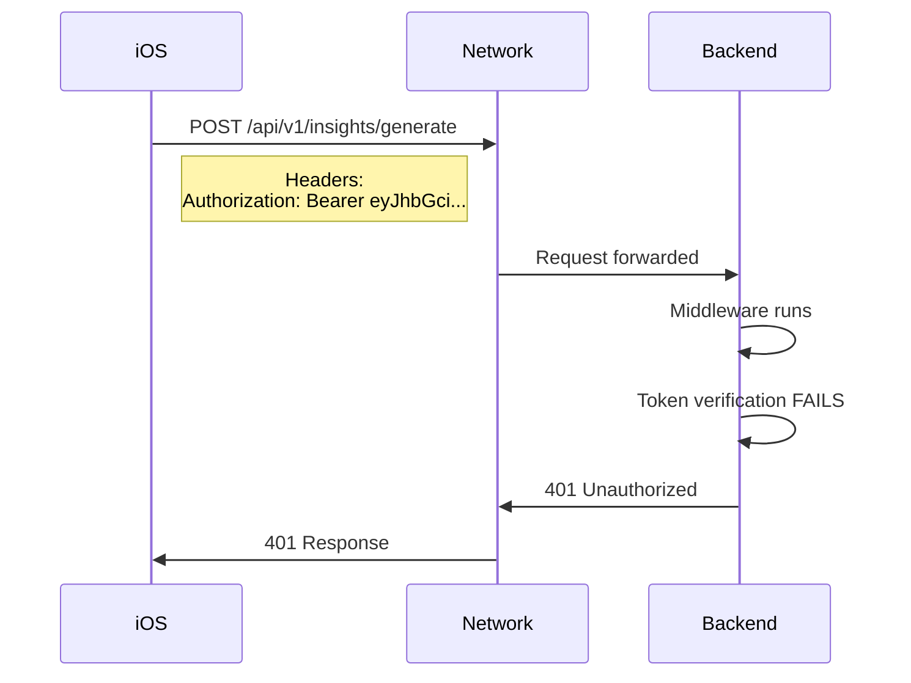

# Frontend vs Backend: The Truth

## What Frontend Says ✅

### Evidence from iOS Logs
```
🔐 TokenManagement: Token refreshed successfully
   - New expiration: 2025-06-09 11:20:55 +0000
   - Token will be valid for: 59.995 minutes
✅ APP: Token obtained from TokenManagementService
   - Length: 933
📤 APIClient: Authorization header set: Bearer eyJhbGci...
📡 APIClient: Sending request to https://crave-trinity-prod--clarity-backend-fastapi-app.modal.run
📥 APIClient: Response status code: 401
```

### Frontend Claims
1. ✅ Tokens are being generated correctly
2. ✅ Tokens are fresh (not expired)
3. ✅ Authorization header is being sent
4. ✅ Token refresh logic is working
5. ✅ Retry on 401 is working

**Frontend Verdict**: Backend is broken

## What Backend Says ❌

### Evidence from Modal Logs
```
2025-06-09 10:22:24 | WARNING | 🔥🔥 MIDDLEWARE ACTUALLY RUNNING: GET /api/v1/debug/auth-check
2025-06-09 10:22:24 | WARNING | 🔥🔥 APP INSTANCE IN MIDDLEWARE: 47694395525120
2025-06-09 10:22:24 | WARNING | No user context in request.state for path: /api/v1/debug/auth-check
GET /api/v1/debug/auth-check -> 401 Unauthorized
```

### Backend Claims
1. ✅ Middleware is running
2. ✅ Requests are being received
3. ❌ Token verification is failing
4. ❌ No user context is being set
5. ❓ No error details about WHY

**Backend Verdict**: Silent failure in Firebase verification

## The Objective Truth 🔍

### Token Analysis
```python
# Decoded token from iOS
{
  "iss": "https://securetoken.google.com/clarity-loop-backend",
  "aud": "clarity-loop-backend",
  "auth_time": 1749332488,
  "user_id": "vW6fVj6kxWgznkShWS6R4FWEh4J2",
  "iat": 1749464455,  # June 9, 10:20:55 UTC
  "exp": 1749468055,  # June 9, 11:20:55 UTC
  "email": "jj@novamindnyc.com",
  "email_verified": true
}

# At request time (10:22:03 UTC)
- Token age: 68 seconds ✅
- Time until expiration: 3532 seconds (~59 minutes) ✅
- Result: TOKEN IS VALID ✅
```

### Network Traffic


## Who Is Right?

### Frontend IS RIGHT about:
- ✅ Tokens are valid and not expired
- ✅ Tokens are being sent correctly
- ✅ Token refresh is working
- ✅ Authorization headers are correct

### Backend IS RIGHT about:
- ✅ Middleware is executing
- ✅ Token verification is failing
- ✅ No user context is being set

### The REAL Issue:
**Backend Firebase Admin SDK is not properly configured**

## The Smoking Gun 🔫

If the backend middleware is running but `request.state.user` is None, then `firebase_admin.auth.verify_id_token()` is failing. Since no error is logged, it's likely:

1. **Firebase Admin not initialized**: `firebase_admin.initialize_app()` not called or failed
2. **Wrong service account**: Using wrong project's credentials
3. **Missing credentials**: Service account JSON not found
4. **Network blocked**: Can't reach Google servers to verify

## Required Backend Fix

```python
# Backend needs to add error logging:
try:
    # This is failing silently
    decoded_token = auth.verify_id_token(token)
except Exception as e:
    # LOG THE ACTUAL ERROR!
    logger.error(f"Firebase token verification failed: {e}")
    raise
```

## Final Verdict

**Both agents are partially correct:**
- Frontend: ✅ Sending valid tokens correctly
- Backend: ✅ Receiving tokens but failing to verify them

**Root Cause**: Backend Firebase Admin SDK configuration issue

**Who needs to fix it**: BACKEND (add error logging and fix Firebase config)