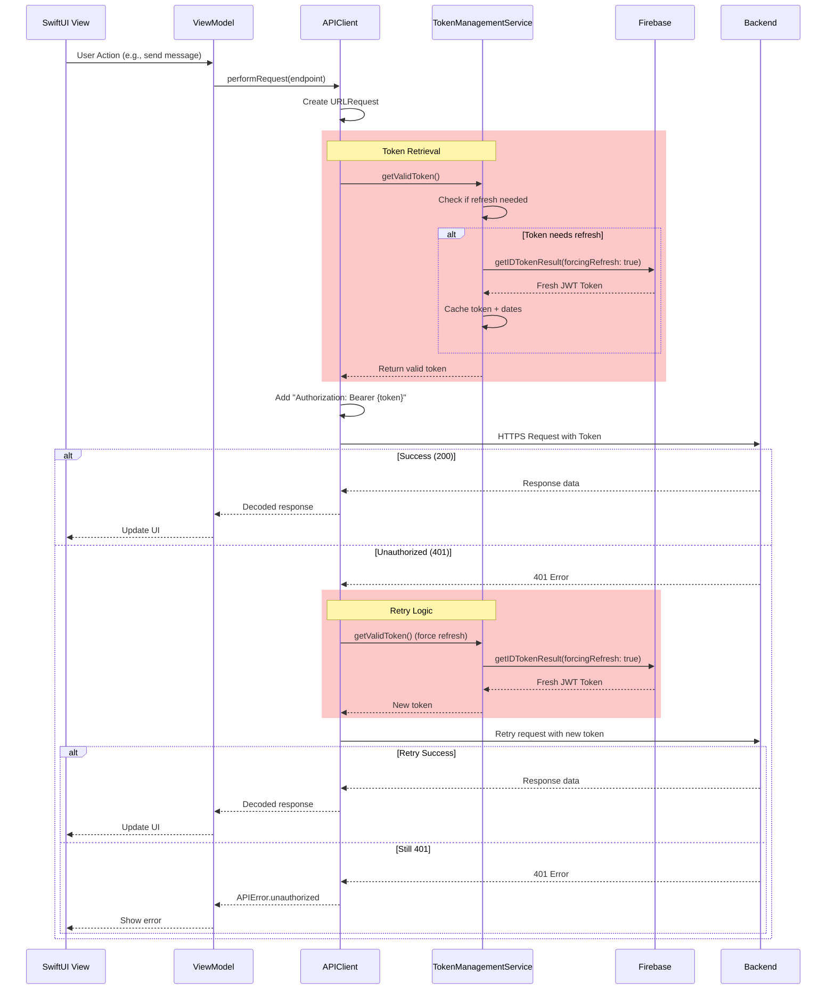

# iOS Authentication Flow - COMPLETE DATA TRACE

## 1. Token Generation Flow

```mermaid
graph TD
    A[App Launch] --> B[FirebaseApp.configure()]
    B --> C[User Login with Firebase]
    C --> D[Firebase Auth Returns User]
    D --> E[TokenManagementService Created]
    
    E --> F{Token Needed?}
    F -->|First Time| G[Force Token Refresh]
    F -->|Cached Valid| H[Return Cached Token]
    F -->|Expired/Old| G
    
    G --> I[Auth.auth().currentUser?.getIDTokenResult(forcingRefresh: true)]
    I --> J[Firebase Contacts Google Servers]
    J --> K[Receive Fresh JWT Token]
    K --> L[Cache Token + Expiration Date]
    L --> M[Return Token to Caller]
    
    H --> M
    
    style G fill:#ff9999
    style I fill:#ff9999
    style K fill:#99ff99
```

## 2. Token Validation Logic

```mermaid
graph TD
    A[getValidToken() Called] --> B{Check Cached Token}
    B -->|No Token| C[Force Refresh]
    B -->|Has Token| D{Check Expiration}
    
    D --> E{Time Until Expiration}
    E -->|< 0 seconds| F[Token EXPIRED]
    E -->|< 5 minutes| G[Token EXPIRING SOON]
    E -->|> 5 minutes| H{Check Token Age}
    
    H -->|> 30 minutes| I[Token TOO OLD]
    H -->|< 30 minutes| J[Token FRESH]
    
    F --> C
    G --> C
    I --> C
    J --> K[Return Cached Token]
    
    C --> L[firebase.getIDTokenResult(forcingRefresh: true)]
    L --> M[Store New Token]
    M --> N[Return Fresh Token]
    
    style F fill:#ff0000
    style G fill:#ffaa00
    style I fill:#ffaa00
    style J fill:#00ff00
```

## 3. API Request Flow



## 4. Current Token Flow Status (FROM LOGS)

```mermaid
graph LR
    A[Token Generated<br/>10:20:55 UTC] --> B[Token Valid Until<br/>11:20:55 UTC]
    B --> C[Current Time<br/>10:31:48 UTC]
    C --> D[Token Still Valid<br/>~50 minutes left]
    
    D --> E[iOS Sends Token<br/>✅ WORKING]
    E --> F[Backend Receives Token<br/>✅ CONFIRMED]
    F --> G[Middleware Runs<br/>✅ CONFIRMED]
    G --> H[Token Verification<br/>❌ FAILING]
    H --> I[401 Unauthorized<br/>❌ ERROR]
    
    style A fill:#99ff99
    style B fill:#99ff99
    style C fill:#99ff99
    style D fill:#99ff99
    style E fill:#99ff99
    style F fill:#99ff99
    style G fill:#99ff99
    style H fill:#ff0000
    style I fill:#ff0000
```



## Token Analysis

### What's Working ✅
1. **Firebase Token Generation**: Successfully creates tokens with correct:
   - Project ID: `clarity-loop-backend`
   - User ID: `vW6fVj6kxWgznkShWS6R4FWEh4J2`
   - Email: `jj@novamindnyc.com`
   - Expiration: 1 hour from issue time

2. **TokenManagementService**: Correctly:
   - Forces refresh when needed
   - Caches tokens
   - Checks expiration
   - Checks token age (30 min threshold)

3. **APIClient**: Properly:
   - Retrieves tokens before requests
   - Adds Authorization header
   - Retries on 401 with fresh token

### What's Failing ❌
1. **Backend Token Verification**: The backend middleware is running but failing to verify valid tokens
2. **request.state.user**: Not being set, indicating Firebase Admin SDK verification failure

## iOS Code References
- Token Provider: `clarity_loop_frontendApp.swift:41-69`
- TokenManagementService: `TokenManagementService.swift:1-124`
- APIClient Token Usage: `APIClient.swift:221-239`
- Environment Default Provider: `EnvironmentKeys.swift:8-18`